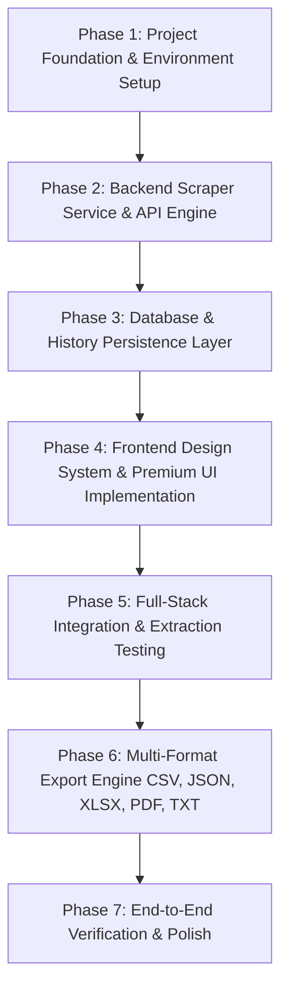

# Project Audit: Web Scraper Application

**Audit Date:** 2026-09-25  
**Auditor:** Senior Full-Stack Engineer  
**Workspace Directory:** `/media/soldier57/BAG/freak/xcrep`  
**Status:** Clean Slate / Greenfield Initialization  

---

## Executive Summary

A comprehensive inspection of the workspace `/media/soldier57/BAG/freak/xcrep` and surrounding system context was performed. 

**Key Findings:**
1. **Workspace State:** The project directory is currently empty. No code, package manifests, database schemas, or configuration files exist in the repository yet.
2. **Design Reference Discovered:** The UI design blueprint for this project was identified from the recent design asset (`ChatGPT Image Sep 25, 2026, 06_48_20 AM.png`), outlining the exact target design system, visual aesthetics, component hierarchy, extraction types, and export formats for **"Web Scraper - Extract. Explore. Analyze."**
3. **Implication:** There is no legacy or broken code to refactor or preserve within this workspace. The project is at the clean slate / foundational setup stage.

---

## 1. Current Architecture
- **State:** Not yet initialized (Greenfield).
- **Target Architecture (Derived from UI Blueprint):**
  - **Client Tier:** Modern Single-Page Application (SPA) dashboard featuring a dark cyberpunk/emerald aesthetic, glassmorphism cards, navigation sidebar, interactive extraction controls, real-time scraping status monitor, data viewer, and multi-format export utility.
  - **Server / API Tier:** Backend service handling URL fetching, HTTP headers/user-agent spoofing, DOM parsing, extraction sanitization, and structured export generation.
  - **Data / Storage Tier:** Persistent storage for scrape history, saved jobs, extracted payloads, and configuration settings.

---

## 2. Frontend Stack
- **Current Framework:** None.
- **Current Structure:** Empty.
- **Target / Recommended Stack:**
  - **Core Framework:** React 19 + Vite (lightweight, rapid HMR, modular component architecture).
  - **Styling:** Vanilla CSS with custom design tokens (matching the sleek dark purple/cyan-teal glassmorphism and glow effects seen in the reference mockup; no bulky utility frameworks unless requested).
  - **Icons:** Lightweight inline SVGs for spider/web logo, globe, links, code, tables, images, metadata, and export formats.

---

## 3. Backend Stack
- **Current Framework:** None.
- **Current Structure:** Empty.
- **Target / Recommended Options:**
  - **Option A (Python FastAPI):** Highly optimal for web scraping workflows (`httpx`, `BeautifulSoup4`, `lxml`, and optional `playwright` for JavaScript-rendered SPAs). Provides automatic OpenAPI documentation, clean async IO, and fast JSON serialization.
  - **Option B (Node.js Express / Fastify):** JavaScript/TypeScript based (`cheerio`, `axios`, `puppeteer`).
  - *Recommendation:* Python FastAPI or Node.js Express depending on preferred environment; Python FastAPI provides superior out-of-the-box scraping and tabular data processing (CSV, Excel via `pandas` or `openpyxl`).

---

## 4. Database Implementation
- **Current Implementation:** None.
- **Target / Recommended Implementation:**
  - Embedded **SQLite** (via SQLAlchemy / Prisma / `better-sqlite3`) or local JSON/file-based storage for lightweight zero-dependency deployment.
  - Schemas required:
    - `scrapes`: `id`, `url`, `status` (`pending`, `completed`, `failed`), `items_count`, `created_at`, `extracted_types`.
    - `scrape_data`: `id`, `scrape_id`, `data_type` (title, text, links, images, headings, tables, metadata, html), `content_json`.
    - `user_settings`: dark/light mode preference, custom user agents, timeouts.

---

## 5. Existing API Endpoints
- **Current Endpoints:** None.
- **Required API Endpoints (to be built):**
  - `POST /api/scrape` — Initiate scrape for a given URL and selected data types.
  - `GET /api/scrapes` — Retrieve recent scrape history with pagination and status.
  - `GET /api/scrapes/{id}` — Retrieve detailed extracted data payload for a specific scrape job.
  - `DELETE /api/scrapes/{id}` — Delete a scrape record and associated data.
  - `GET /api/export/{id}?format=(csv|json|xlsx|pdf|txt)` — Export extracted data in the requested file format.
  - `GET /api/health` — Service health check.

---

## 6. Existing Components / Pages
- **Current Components:** None.
- **Required Components (Identified from Reference UI):**
  1. **Sidebar Navigation:**
     - Brand header with spider/web icon and title.
     - Nav items: *Dashboard* (active), *Scrape*, *History*, *Saved Data*, *Export*, *Settings*.
     - Bottom "Pro Version" upgrade card with feature list and CTA button.
  2. **Top Navigation Bar:**
     - Quick Search Bar (`Ctrl + K` shortcut indicator).
     - Theme Toggle (Dark / Light mode).
     - Notifications icon with indicator.
     - User Profile Dropdown ("Jagan").
  3. **Hero & Welcome Section:**
     - "WELCOME BACK" greeting.
     - Gradient heading: "Web Scraper".
     - Subtitle: "Extract meaningful data from any website in seconds."
     - Feature highlight pills (*Fast & Reliable*, *Multiple Data Types*, *Export Anywhere*).
     - Neon 3D glowing globe and extraction badge graphics.
  4. **Scraper Action Card:**
     - Website URL input field with "Load Example" trigger.
     - "Start Scraping ->" primary CTA button.
     - Selective data type checkboxes: *Extract All*, *Text*, *Links*, *Images*, *Headings*, *Tables*, *Metadata*.
  5. **"What You Can Extract" Feature Grid (8 Cards):**
     - Page Title, Clean Text, All Links, Images, Headings, Tables, Metadata, HTML Source.
  6. **Data Display & Recent Scrapes Table:**
     - Recent scrapes listing with Website URL, Data Extracted count, Status badge, and Date.
     - Row action menu (view, export, delete).
  7. **Quick Export Panel:**
     - Direct export buttons for CSV, JSON, Excel, PDF, TXT.
     - "Export Current Data ->" action button.

---

## 7. Package Managers & Dependencies
- **Current:** None initialized.
- **Frontend Dependencies (Proposed):** `npm` / `vite`, `react`, `react-dom`, `lucide-react` (or custom SVGs).
- **Backend Dependencies (Proposed):** `pip` / `python` (`fastapi`, `uvicorn`, `httpx`, `beautifulsoup4`, `lxml`, `pandas`, `openpyxl`) or `npm` (`express`, `cheerio`, `axios`, `cors`).

---

## 8. Environment Variables & Configuration
- **Current:** None.
- **Required Configuration:**
  - Backend: `PORT`, `HOST`, `DATABASE_URL`, `CORS_ORIGINS`, `MAX_CONCURRENT_SCRAPES`, `REQUEST_TIMEOUT`.
  - Frontend: `VITE_API_BASE_URL`.

---

## 9. What Functionality Already Works
- **Current Active State:** 0% (Clean repository waiting for initial architecture setup).

---

## 10. Incomplete, Broken, Duplicate, or Unnecessary Code
- **Findings:** None. The repository is clean, with no stale code, orphaned dependencies, or conflicting configurations.

---

## Recommended Implementation Order

To deliver the complete, production-grade application matching the visual specification, the following phased implementation order is recommended:

1. **Phase 1: Foundation & Structure Setup**
   - Initialize project root structure (`backend/` and `frontend/`).
   - Configure environment variables and `.gitignore`.
2. **Phase 2: Backend Scraping Core & API**
   - Implement scraping engine supporting all 8 extraction types (Title, Text, Links, Images, Headings, Tables, Metadata, HTML).
   - Implement rate limiting, timeout handling, and User-Agent headers.
   - Expose REST API endpoints for scraping and status checks.
3. **Phase 3: Persistence Layer**
   - Setup SQLite database schema for storing scrape jobs, metadata, and extracted records.
   - Implement CRUD endpoints for history and saved scrapes.
4. **Phase 4: Frontend UI Construction**
   - Build the complete UI layout adhering strictly to the reference design (Sidebar, Navbar, Hero, Scraper Input Card, Feature Grid, History Table, Export Widget).
   - Implement the dark/emerald cyberpunk aesthetic with glassmorphism, responsive grid, and micro-animations.
5. **Phase 5: Frontend-Backend Integration**
   - Connect URL submission to the backend scraping API with live progress indicators.
   - Display real-time extraction results and populate the recent scrapes table dynamically.
6. **Phase 6: Multi-Format Export Engine**
   - Implement export handlers for CSV, JSON, Excel (.xlsx), PDF, and plain text (.txt).
7. **Phase 7: Comprehensive Validation & Testing**
   - Test against various target websites (static HTML, semantic sites, media-heavy pages).
   - Verify responsive behavior across desktop (1920x1080), laptop, and tablet viewports.
